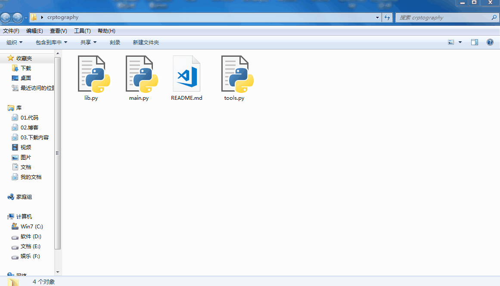
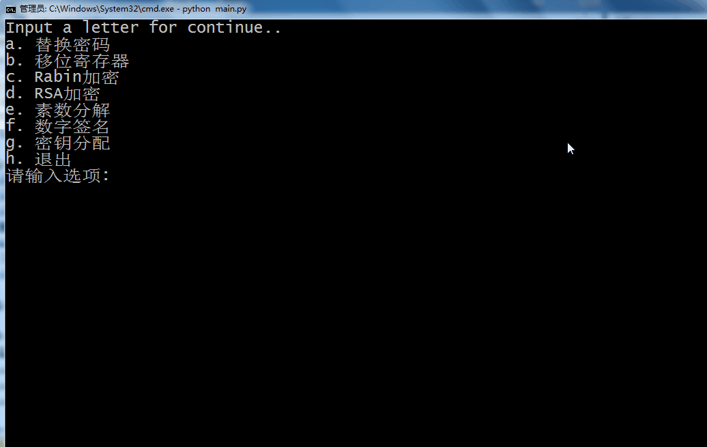
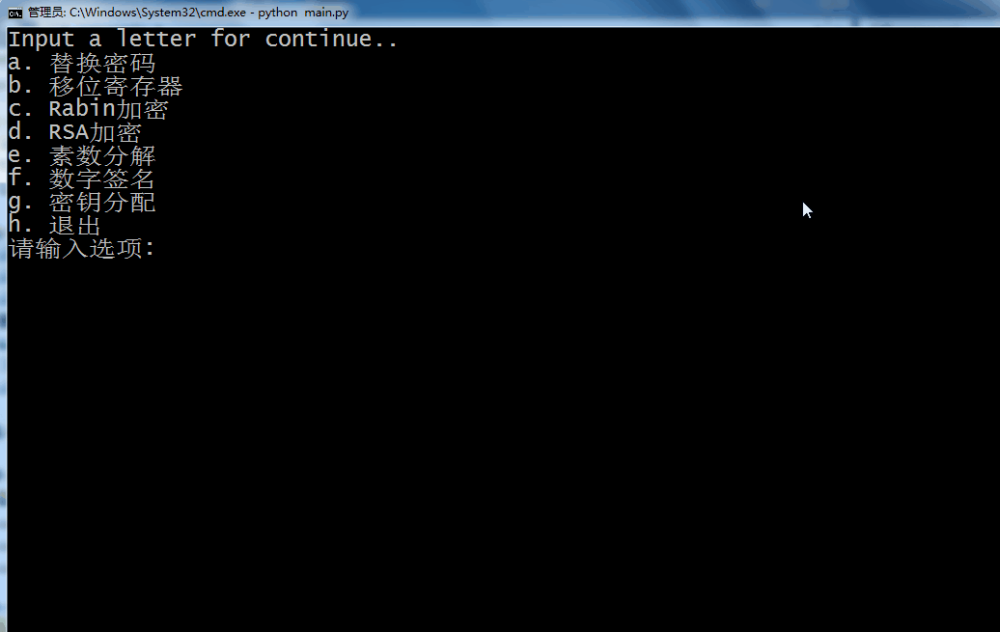

### What's this?
这是一个基于python开发的命令行工具

### 目的: 
用于分析解决密码学常见问题

### 用途: 
整合提供了便捷的密码生成，解密，分析与攻击工具,辅助解决密码学一些较常见的计算问题。
* 替换密码
    * 加密变换
    * 解密变换
    * 字典破解
* 移位寄存器
    * 周期计算
    * 密钥破解
* Rabin加密
    * Rabin密码加密工具
    * Rabin密码攻击工具
* RSA加密
    * RSA密码加密工具
    * RSA密码攻击工具
* 素数分解
    * 大素数分解
* 数字签名
    * 消息签名
    * 签名验证
* 密钥分配
    * 中国剩余定理分配密钥
    * 中国剩余定理还原密钥
    * Shamir还原密钥

### 使用说明
1. 打开工具

在资源管理器窗口输入
```
cmd
```
并回车，在弹出的命令行中输入
```
python main.py
```
即可使用



2. 菜单操作

在菜单界面输入**选项对应的字母**并回车选中菜单
每个菜单界面选中**最后一个选项**返回上级
> 特别地,主菜单界面的最后一项代表退出程序

3. 使用工具

从菜单选中工具后进入使用界面
按照提示输入参数即可



4. 完整例子(线形反馈移位寄存器的使用)


